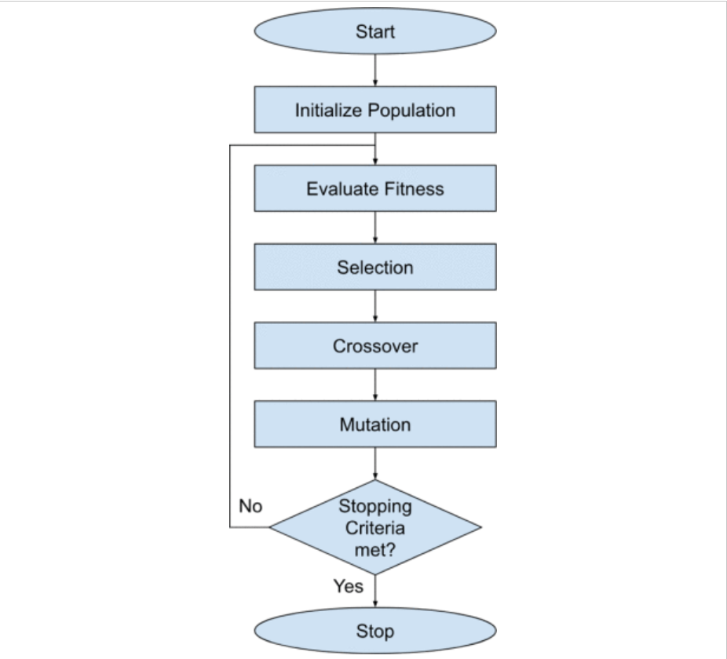
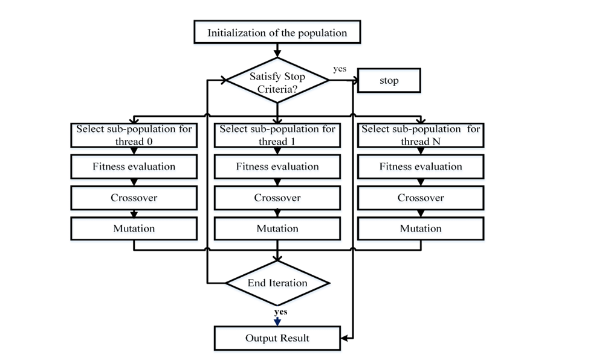
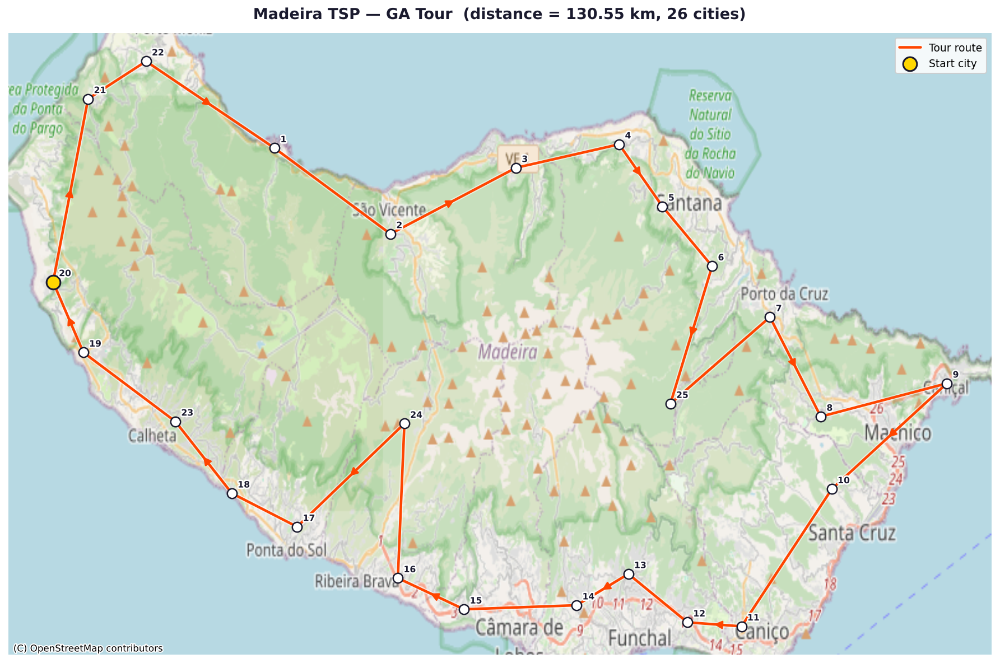

# Traveling Salesman Problem — GPU Approaches

Experiments comparing CPU and GPU-accelerated heuristics for the Travelling Salesman Problem (TSP).  
The project follows a structured progression: **Python baseline → sequential C → naive GPU → optimized GPU**, so that each stage can be validated against the one before it.

---

## Roadmap

| Stage | Status | Description |
|-------|--------|-------------|
| **1. Python baseline** | ✅ Done | pyCombinatorial (GA, ACO, Hilbert SFC) — correctness reference |
| **2. Sequential C** | ✅ Done | Single-threaded C99 GA with tests, regression checks, and benchmarking |
| **3. Naive GPU (CUDA)** | ✅ Done | CUDA baseline (`GPU-Naive.cu`) for parallel tour-length evaluation |
| **4. GPU GA variants (CUDA)** | ✅ In Progress | Hybrid host+GPU GA (`CUDA-GA.cu`) and GPU island model (`CUDA-GA-GPU-Pop.cu`) |

The Python baseline is the ground truth. Every subsequent implementation must produce tours within an acceptable tolerance of the Python results before moving forward.

---

## Algorithm — Genetic Algorithm

<table>
  <tr>
    <td align="center" width="50%">
      <br/>
      <sub><b>Sequential GA</b></sub>
    </td>
    <td align="center" width="50%">
      <br/>
      <sub><b>Parallel GA (GPU)</b></sub>
    </td>
  </tr>
</table>

---

## Project Structure

```
.
├── baselines/                        # Python baseline (correctness reference)
│   ├── ga_runner.py                  # Core helpers: load data, build matrix, run GA
│   ├── py_combinatorial_ga_example_berlin52.py
│   └── pycombinatorial_latlong_compare.py   # ACO / GA / Hilbert SFC on Madeira dataset
├── sequential/                       # Sequential C99 GA implementation
├── GPU-Naive.cu                      # Naive CUDA tour-length evaluation
├── CUDA-GA.cu                        # Hybrid GA: CPU evolution + GPU fitness
├── CUDA-GA-GPU-Pop.cu                # GPU island-model GA
├── tsplib_parser.cpp/.h              # TSPLIB parser used by C/CUDA executables
├── tests/                            # Pytest test suite
│   └── test_pycombinatorial_ga.py
├── docs/                             # Technical notes and CUDA implementation docs
├── results/                          # Output CSVs and HTML maps (git-ignored)
├── img/
│   └── flow-chart.png
├── requirements.txt
└── README.md
```

---

## 1. Set Up the Environment

> Python 3.10+ recommended. CUDA toolkit required for GPU approaches.

```bash
# Clone the repo
git clone https://github.com/<your-username>/Traveling-salesman-GPU.git
cd Traveling-salesman-GPU

# Create and activate a virtual environment
python -m venv venv

# Windows
venv\Scripts\activate

# macOS / Linux
source venv/bin/activate
```

---

## 2. Install Requirements

```bash
pip install -r requirements.txt
```

> To regenerate `requirements.txt` after adding packages:
> ```bash
> pip freeze > requirements.txt
> ```

---

## 3. Run the Baseline Examples

### 3a. Berlin52 — GA only

Runs the GA on the classic Berlin52 dataset and saves a summary CSV.

```bash
python baselines/py_combinatorial_ga_example_berlin52.py
```

### 3b. Madeira — ACO vs Hilbert SFC vs GA (lat/long dataset)

Runs all three algorithms on the Madeira island dataset and saves results + interactive HTML maps.

```bash
python baselines/pycombinatorial_latlong_compare.py
```

---

## 4. Input Data — Madeira Dataset

The raw input is a tab-separated file of 25 cities on Madeira island, each with a name, latitude, and longitude.  
A cleaned copy is saved at [`data/madeira_cities.csv`](data/madeira_cities.csv).

| id | city | Lat | Long |
|----|------|-----|------|
| 1 | Seixal | 32.824309 | -17.111078 |
| 2 | Sao_Vicente | 32.793790 | -17.046956 |
| 3 | Boaventura | 32.817304 | -16.977539 |
| 4 | Sao_Jorge | 32.825660 | -16.920450 |
| 5 | Santana | 32.803557 | -16.896486 |
| 6 | Faial | 32.782290 | -16.869005 |
| 7 | Porto_da_Cruz | 32.764190 | -16.837015 |
| 8 | Machico | 32.728766 | -16.808902 |
| 9 | Canical | 32.740586 | -16.739115 |
| 10 | Santa_Cruz | 32.702940 | -16.802803 |
| 11 | Canico | 32.654046 | -16.852745 |
| 12 | Sao_Goncalo | 32.655487 | -16.882707 |
| 13 | Monte | 32.672723 | -16.915337 |
| 14 | Santo_Antonio | 32.661563 | -16.944008 |
| 15 | Camara_de_Lobos | 32.660118 | -17.006246 |
| 16 | Campanario | 32.671240 | -17.042864 |
| 17 | Ponta_do_Sol | 32.689528 | -17.098606 |
| 18 | Madelane_do_Mar | 32.701437 | -17.134676 |
| 19 | Prazeres | 32.751613 | -17.216841 |
| 20 | Faja_da_Ovelha | 32.776683 | -17.233584 |
| 21 | Achadas_da_Cruz | 32.841827 | -17.214240 |
| 22 | Levada_Grande | 32.855182 | -17.182168 |
| 23 | Serra_de_Agua | 32.727035 | -17.165940 |
| 24 | Curral_das_Freiras | 32.726280 | -17.039234 |
| 25 | Ribeiro_Frio | 32.733332 | -16.892088 |

The distance matrix is computed using the **Haversine formula** (great-circle distance in km) and passed directly to each algorithm.

---

## 5. Baseline Results — Madeira Dataset (25 cities, lat/long)

> Results from a single run on CPU (Python 3.14, pyCombinatorial 2.1.8).  
> These serve as the **correctness target** for future C and CUDA implementations.

| Algorithm | Tour Distance (km) | Runtime (s) | Notes |
|-----------|-------------------|-------------|-------|
| **ACO** | 130.55 | 3.54 | 100 iterations, 15 ants, local search |
| **Hilbert SFC** | 135.32 | 0.08 | Space-filling curve heuristic, local search |
| **GA** | 130.55 | 38.07 | 300 generations, pop 30, local search |

Interactive HTML tour maps: `results/map_aco.html`, `results/map_ga.html`

### GA Best Tour



City numbers correspond to the `id` column in [`data/madeira_cities.csv`](data/madeira_cities.csv). The yellow dot marks the tour start city.

Key observations:
- ACO and GA converge to the same tour distance (130.55 km), confirming solution quality.
- Hilbert SFC is ~450× faster but 3.6% longer — useful as a warm-start for other methods.
- GA runtime (38 s on CPU for 26 cities) is the primary motivation for GPU acceleration.

---

## 6. Run the Tests

Run all tests (`pytest` is included in `requirements.txt`):

```bash
python -m pytest tests/ -v
```

Run a single test file:

```bash
python -m pytest tests/test_pycombinatorial_ga.py -v
```

### Test Coverage

| Test | What it checks |
|------|---------------|
| `test_coordinates_loading` | Dataset fetches correctly; shape is `(n, 2)` |
| `test_distance_matrix_properties` | Matrix is square, diagonal is 0, symmetric |
| `test_ga_returns_valid_solution` | Route is a valid permutation; distance > 0 |
| `test_ga_improves_over_random` | GA solution ≤ random tour length |

> Tests use only 50 generations and population 10 to stay fast (< 30 s on CPU).

---

## 7. Run the Sequential C Version

The sequential implementation lives under `sequential/` and builds via `Makefile`.

### 7.1 Build

```bash
cd sequential
make clean
make all
```

### 7.2 Run tests

```bash
make test
```

### 7.3 Run GA executable

Linux/macOS:

```bash
./bin/ga-tsp --instance tests/fixtures/smoke_20.tsp --pop 100 --gen 200 --seed 42 --elites 2 --tk 3 --pc 0.9 --pm 0.1 --csv results.csv
```

Windows PowerShell:

```powershell
.\bin\ga-tsp.exe --instance tests\fixtures\smoke_20.tsp --pop 100 --gen 200 --seed 42 --elites 2 --tk 3 --pc 0.9 --pm 0.1 --csv results.csv
```

Optional executables:

- `bin/skeleton` or `bin/skeleton.exe`
- `bin/stress_crossover` or `bin/stress_crossover.exe`
- `bin/stress_mutation` or `bin/stress_mutation.exe`

## 8. Run the CUDA Versions

Prerequisites:

- NVIDIA GPU + driver
- CUDA Toolkit with `nvcc` in PATH

From repository root, compile each executable by linking its `.cu` file with `tsplib_parser.cpp`.

### 8.1 Build CUDA executables

Linux/macOS:

```bash
nvcc -O2 -std=c++17 -arch=sm_60 -o GPU-Naive GPU-Naive.cu tsplib_parser.cpp
nvcc -O2 -std=c++17 -arch=sm_60 -o CUDA-GA CUDA-GA.cu tsplib_parser.cpp
nvcc -O2 -std=c++17 -arch=sm_60 -o CUDA-GA-GPU-Pop CUDA-GA-GPU-Pop.cu tsplib_parser.cpp
```

Windows PowerShell:

```powershell
nvcc -O2 -std=c++17 -arch=sm_60 -o GPU-Naive.exe GPU-Naive.cu tsplib_parser.cpp
nvcc -O2 -std=c++17 -arch=sm_60 -o CUDA-GA.exe CUDA-GA.cu tsplib_parser.cpp
nvcc -O2 -std=c++17 -arch=sm_60 -o CUDA-GA-GPU-Pop.exe CUDA-GA-GPU-Pop.cu tsplib_parser.cpp
```

If your GPU is not Pascal/P100, adjust `-arch=sm_60` to your compute capability.

### 8.2 Run GPU-Naive

Linux/macOS:

```bash
./GPU-Naive sequential/tests/fixtures/smoke_20.tsp
```

Windows PowerShell:

```powershell
.\GPU-Naive.exe sequential\tests\fixtures\smoke_20.tsp
```

### 8.3 Run CUDA-GA (hybrid)

Usage:

```text
CUDA-GA <file.tsp> [population=512] [generations=1000] [mutation_rate=0.05] [elite_count=4] [seed=auto]
```

Example:

```bash
./CUDA-GA sequential/tests/fixtures/smoke_20.tsp 512 1000 0.05 4 42
```

### 8.4 Run CUDA-GA-GPU-Pop (island model)

Usage:

```text
CUDA-GA-GPU-Pop <file.tsp> [islands=128] [generations=1000] [mutation_rate=0.05] [elite_count=2] [seed=auto]
```

Example:

```bash
./CUDA-GA-GPU-Pop sequential/tests/fixtures/smoke_20.tsp 128 1000 0.05 2 42
```

Note: this version currently enforces `MAX_CITIES=128`.

## 9. Compare Python Baseline vs Sequential C (Same Instance)

### 9.0 Recommended Run Profiles

Use these two profiles depending on what you want to measure:

1. Normal run (similar parameters, fast): same high-level GA knobs for Python and C (`pop=100`, `gen=200`, `mutation=0.1`, `elite=2`).
2. Budgeted C run (~1/10 Python time): keep C settings fixed except increase generations to consume about one-tenth of Python runtime.

Normal fast comparison command:

```bash
python baselines/compare_python_vs_sequential_ga.py --tsp sequential/tests/fixtures/smoke_20.tsp --pop 100 --gen 200 --mutation 0.1 --elite 2 --seed 42
```

Budgeted C-only run command (targeting ~1/10 of Python runtime observed on this machine):

```powershell
.\sequential\bin\ga-tsp.exe --instance .\sequential\tests\fixtures\smoke_20.tsp --pop 100 --gen 150000 --seed 42 --elites 2 --tk 3 --pc 0.9 --pm 0.1 --csv .\sequential\results_budget_1tenth.csv
```

Why this split is useful:

- Normal run gives quick apples-to-apples comparison for iteration/testing.
- Budgeted run gives C more search time while still bounded by a reproducible time budget.

Use this script to run both implementations on the same TSPLIB coordinate file, measure runtime, and compare route/distance:

`baselines/compare_python_vs_sequential_ga.py`

From repository root:

```bash
python baselines/compare_python_vs_sequential_ga.py --tsp sequential/tests/fixtures/smoke_20.tsp --pop 100 --gen 200 --mutation 0.1 --elite 2 --seed 42
```

What it does:

- Runs pyCombinatorial GA on the parsed TSPLIB coordinates.
- Builds and runs `sequential/bin/ga-tsp` (or `.exe` on Windows) with matching parameters.
- Captures elapsed time for both.
- Compares tours in a cycle-invariant way (rotation/reversal equivalent).
- Saves full details to `results/python_vs_sequential_compare.txt`.

Tip: add `--no-release-build` if you do not want the script to force `BUILD=release` for the sequential binary.

### 9.1 Latest Measured Results (`smoke_20.tsp`)

Comparison command used:

```bash
python baselines/compare_python_vs_sequential_ga.py --tsp sequential/tests/fixtures/smoke_20.tsp --pop 100 --gen 200 --mutation 0.1 --elite 2 --seed 42
```

| Implementation | Distance | Runtime (s) | Tour length (cities) | Equivalent tour (rotation/reversal) |
|---|---:|---:|---:|---|
| Python baseline (pyCombinatorial) | 75.776906 | 41.956912 | 20 | False |
| Sequential C (`ga-tsp`) | 77.492495 | 0.055615 | 20 | False |

Tour order (Python baseline):

```text
13 -> 12 -> 1 -> 8 -> 18 -> 4 -> 17 -> 2 -> 3 -> 16 -> 19 -> 10 -> 9 -> 11 -> 5 -> 20 -> 6 -> 7 -> 15 -> 14 -> 13
```

Tour order (Sequential C):

```text
9 -> 6 -> 5 -> 19 -> 8 -> 10 -> 4 -> 14 -> 13 -> 7 -> 17 -> 3 -> 16 -> 1 -> 2 -> 0 -> 15 -> 12 -> 11 -> 18 -> 9
```

Outputs saved by the script:

- `results/python_vs_sequential_compare.csv`
- `results/python_vs_sequential_compare.txt`

### 9.2 Longer Sequential Budgeted Run (~1/10 Python runtime)

Sequential command used:

```powershell
.\sequential\bin\ga-tsp.exe --instance .\sequential\tests\fixtures\smoke_20.tsp --pop 100 --gen 150000 --seed 42 --elites 2 --tk 3 --pc 0.9 --pm 0.1 --csv .\sequential\results_budget_1tenth.csv
```

Measured runtime: `4.0735 s` (target budget was `~4.1957 s`).

Result summary:

- Best distance: `77.073275`
- Tour length: `20`
- Tour order:

```text
10 -> 4 -> 14 -> 13 -> 12 -> 11 -> 0 -> 7 -> 17 -> 3 -> 16 -> 1 -> 2 -> 15 -> 18 -> 9 -> 6 -> 5 -> 19 -> 8 -> 10
```

Output CSV:

- `sequential/results_budget_1tenth.csv`

## 10. Next Steps

**Current focus areas**
- Benchmark sequential vs all CUDA executables on the same TSPLIB instances and parameter sets.
- Add a shared build script/Makefile for CUDA targets to avoid manual `nvcc` commands.
- Extend GPU-population GA beyond `MAX_CITIES=128` (current constant-memory constraint).
- Add island migration and more advanced in-kernel selection/sorting strategies.
- Record reproducible experiment runs (instance, seed, config, runtime, best tour length) in `results/`.

---

## 11. Reference — NVIDIA cuOpt

> [NVIDIA cuOpt](https://build.nvidia.com/nvidia/nvidia-cuopt) is NVIDIA's production-grade, GPU-accelerated decision optimization engine. It is the state-of-the-art reference for what fully optimized GPU-based TSP/VRP solving looks like.

| Property | Detail |
|----------|--------|
| **Solves** | TSP, VRP, PDP, LP, MILP, QP |
| **Core** | C++ engine with Python, C, and REST server APIs |
| **Approach** | Generates an initial population, then iteratively improves using GPU-accelerated heuristics (local search, feasibility pump, etc.) until a time limit is reached |
| **Scale** | Millions of variables and constraints |
| **Deployment** | pip, conda, Docker (`nvidia/cuopt`), NGC container, API Catalog microservice |
| **License** | Open source (GitHub) + NVIDIA AI Enterprise for production support |

**Why it matters for this project:**  
cuOpt represents the ceiling of GPU-accelerated TSP performance. It would be interesting at the end to compare our algorithm with CuOPT.
**Links:**
- [Interactive demo (API Catalog)](https://build.nvidia.com/nvidia/nvidia-cuopt)
- [Product page](https://www.nvidia.com/en-us/ai-data-science/products/cuopt/)
- [Documentation](https://docs.nvidia.com/cuopt/user-guide/introduction.html)
- [GitHub (open source)](https://github.com/NVIDIA/cuopt)
- [Google Colab examples](https://colab.research.google.com/github/NVIDIA/cuopt-examples/blob/cuopt_examples_launcher/cuopt_examples_launcher.ipynb)
