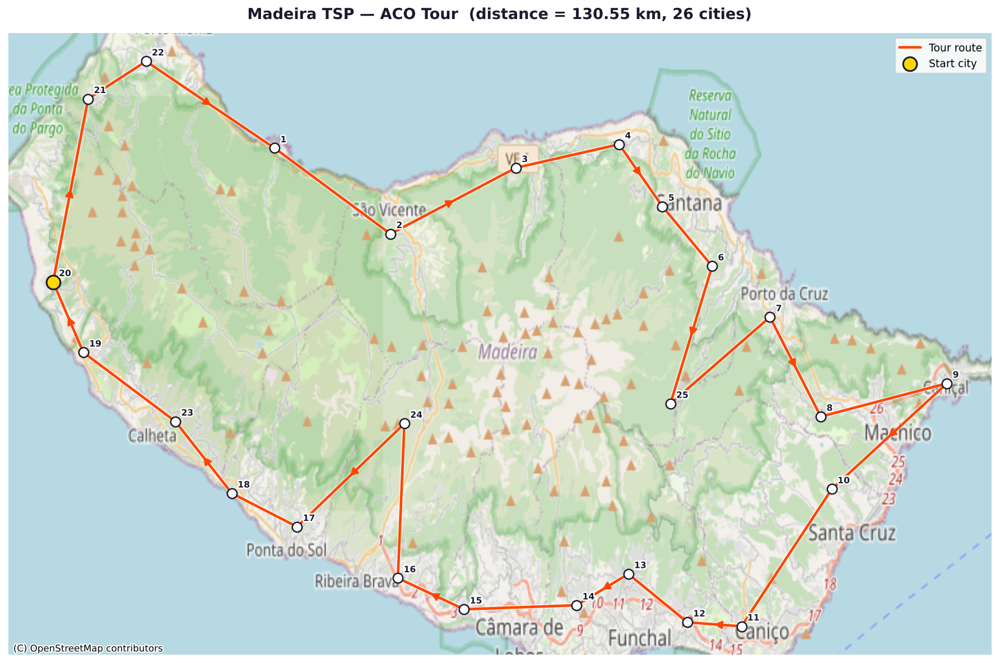

# Traveling Salesman Problem — GPU Approaches

Experiments comparing CPU and GPU-accelerated heuristics for the Travelling Salesman Problem (TSP).  
The project follows a structured progression: **Python baseline → sequential C → naive GPU → optimized GPU**, so that each stage can be validated against the one before it.

---

## Roadmap

| Stage | Status | Description |
|-------|--------|-------------|
| **1. Python baseline** | ✅ Done | pyCombinatorial (GA, ACO, Hilbert SFC) — correctness reference |
| **2. Sequential C** | 🔲 Next | Single-threaded C implementation of the GA |
| **3. Naive GPU (CUDA)** | 🔲 Planned | Port fitness evaluation to GPU, no memory optimizations |
| **4. Optimized GPU (CUDA)** | 🔲 Planned | Shared memory, coalesced access, warp-level primitives |

The Python baseline is the ground truth. Every subsequent implementation must produce tours within an acceptable tolerance of the Python results before moving forward.

---

## Algorithm — Genetic Algorithm


---

## Project Structure

```
.
├── baselines/                        # Python baseline (correctness reference)
│   ├── ga_runner.py                  # Core helpers: load data, build matrix, run GA
│   ├── py_combinatorial_ga_example_berlin52.py
│   └── pycombinatorial_latlong_compare.py   # ACO / GA / Hilbert SFC on Madeira dataset
├── approaches/                       # C and CUDA implementations (WIP)
├── tests/                            # Pytest test suite
│   └── test_pycombinatorial_ga.py
├── results/                          # Output CSVs and HTML maps (git-ignored)
├── img/
│   └── flow-chart.png
├── requirements.txt
└── README.md
```

---

## 1. Set Up the Environment

> Python 3.10+ recommended. CUDA toolkit required for GPU approaches.

```bash
# Clone the repo
git clone https://github.com/<your-username>/Traveling-salesman-GPU.git
cd Traveling-salesman-GPU

# Create and activate a virtual environment
python -m venv venv

# Windows
venv\Scripts\activate

# macOS / Linux
source venv/bin/activate
```

---

## 2. Install Requirements

```bash
pip install -r requirements.txt
```

> To regenerate `requirements.txt` after adding packages:
> ```bash
> pip freeze > requirements.txt
> ```

---

## 3. Run the Baseline Examples

### 3a. Berlin52 — GA only

Runs the GA on the classic Berlin52 dataset and saves a summary CSV.

```bash
python baselines/py_combinatorial_ga_example_berlin52.py
```

### 3b. Madeira — ACO vs Hilbert SFC vs GA (lat/long dataset)

Runs all three algorithms on the Madeira island dataset and saves results + interactive HTML maps.

```bash
python baselines/pycombinatorial_latlong_compare.py
```

---

## 4. Input Data — Madeira Dataset

The raw input is a tab-separated file of 25 cities on Madeira island, each with a name, latitude, and longitude.  
A cleaned copy is saved at [`data/madeira_cities.csv`](data/madeira_cities.csv).

| id | city | Lat | Long |
|----|------|-----|------|
| 1 | Seixal | 32.824309 | -17.111078 |
| 2 | Sao_Vicente | 32.793790 | -17.046956 |
| 3 | Boaventura | 32.817304 | -16.977539 |
| 4 | Sao_Jorge | 32.825660 | -16.920450 |
| 5 | Santana | 32.803557 | -16.896486 |
| 6 | Faial | 32.782290 | -16.869005 |
| 7 | Porto_da_Cruz | 32.764190 | -16.837015 |
| 8 | Machico | 32.728766 | -16.808902 |
| 9 | Canical | 32.740586 | -16.739115 |
| 10 | Santa_Cruz | 32.702940 | -16.802803 |
| 11 | Canico | 32.654046 | -16.852745 |
| 12 | Sao_Goncalo | 32.655487 | -16.882707 |
| 13 | Monte | 32.672723 | -16.915337 |
| 14 | Santo_Antonio | 32.661563 | -16.944008 |
| 15 | Camara_de_Lobos | 32.660118 | -17.006246 |
| 16 | Campanario | 32.671240 | -17.042864 |
| 17 | Ponta_do_Sol | 32.689528 | -17.098606 |
| 18 | Madelane_do_Mar | 32.701437 | -17.134676 |
| 19 | Prazeres | 32.751613 | -17.216841 |
| 20 | Faja_da_Ovelha | 32.776683 | -17.233584 |
| 21 | Achadas_da_Cruz | 32.841827 | -17.214240 |
| 22 | Levada_Grande | 32.855182 | -17.182168 |
| 23 | Serra_de_Agua | 32.727035 | -17.165940 |
| 24 | Curral_das_Freiras | 32.726280 | -17.039234 |
| 25 | Ribeiro_Frio | 32.733332 | -16.892088 |

The distance matrix is computed using the **Haversine formula** (great-circle distance in km) and passed directly to each algorithm.

---

## 5. Baseline Results — Madeira Dataset (25 cities, lat/long)

> Results from a single run on CPU (Python 3.14, pyCombinatorial 2.1.8).  
> These serve as the **correctness target** for future C and CUDA implementations.

| Algorithm | Tour Distance (km) | Runtime (s) | Notes |
|-----------|-------------------|-------------|-------|
| **ACO** | 130.55 | 3.54 | 100 iterations, 15 ants, local search |
| **Hilbert SFC** | 135.32 | 0.08 | Space-filling curve heuristic, local search |
| **GA** | 130.55 | 38.07 | 300 generations, pop 30, local search |

Interactive HTML tour maps: `results/map_aco.html`, `results/map_ga.html`

### ACO Best Tour



City numbers correspond to the `id` column in [`data/madeira_cities.csv`](data/madeira_cities.csv). The red dot marks the tour start city (Ribeiro Frio, city 25).

Key observations:
- ACO and GA converge to the same tour distance (130.55 km), confirming solution quality.
- Hilbert SFC is ~450× faster but 3.6% longer — useful as a warm-start for other methods.
- GA runtime (38 s on CPU for 26 cities) is the primary motivation for GPU acceleration.

---

## 6. Run the Tests

Run all tests (`pytest` is included in `requirements.txt`):

```bash
python -m pytest tests/ -v
```

Run a single test file:

```bash
python -m pytest tests/test_pycombinatorial_ga.py -v
```

### Test Coverage

| Test | What it checks |
|------|---------------|
| `test_coordinates_loading` | Dataset fetches correctly; shape is `(n, 2)` |
| `test_distance_matrix_properties` | Matrix is square, diagonal is 0, symmetric |
| `test_ga_returns_valid_solution` | Route is a valid permutation; distance > 0 |
| `test_ga_improves_over_random` | GA solution ≤ random tour length |

> Tests use only 50 generations and population 10 to stay fast (< 30 s on CPU).

---

## 7. Next Steps

**Stage 2 — Sequential C implementation**
- Re-implement the GA (`initialize`, `evaluate`, `select`, `crossover`, `mutate`) in C
- Validate: tour distance must match Python baseline within ±0.1%
- Measure: establish single-thread CPU runtime as baseline for GPU speedup calculations

**Stage 3 — Naive GPU (CUDA)**
- Parallelize fitness evaluation across threads (one thread per candidate tour)
- No memory hierarchy optimizations yet
- Target: correct results, measure raw GPU vs CPU speedup

**Stage 4 — Optimized GPU (CUDA)**
- Shared memory for distance matrix tiles
- Coalesced global memory access
- Warp-level reduction for fitness aggregation

---

## 8. Reference — NVIDIA cuOpt

> [NVIDIA cuOpt](https://build.nvidia.com/nvidia/nvidia-cuopt) is NVIDIA's production-grade, GPU-accelerated decision optimization engine. It is the state-of-the-art reference for what fully optimized GPU-based TSP/VRP solving looks like.

| Property | Detail |
|----------|--------|
| **Solves** | TSP, VRP, PDP, LP, MILP, QP |
| **Core** | C++ engine with Python, C, and REST server APIs |
| **Approach** | Generates an initial population, then iteratively improves using GPU-accelerated heuristics (local search, feasibility pump, etc.) until a time limit is reached |
| **Scale** | Millions of variables and constraints |
| **Deployment** | pip, conda, Docker (`nvidia/cuopt`), NGC container, API Catalog microservice |
| **License** | Open source (GitHub) + NVIDIA AI Enterprise for production support |

**Why it matters for this project:**  
cuOpt represents the ceiling of GPU-accelerated TSP performance. It would be interesting at the end to compare our algorithm with CuOPT.
**Links:**
- [Interactive demo (API Catalog)](https://build.nvidia.com/nvidia/nvidia-cuopt)
- [Product page](https://www.nvidia.com/en-us/ai-data-science/products/cuopt/)
- [Documentation](https://docs.nvidia.com/cuopt/user-guide/introduction.html)
- [GitHub (open source)](https://github.com/NVIDIA/cuopt)
- [Google Colab examples](https://colab.research.google.com/github/NVIDIA/cuopt-examples/blob/cuopt_examples_launcher/cuopt_examples_launcher.ipynb)
